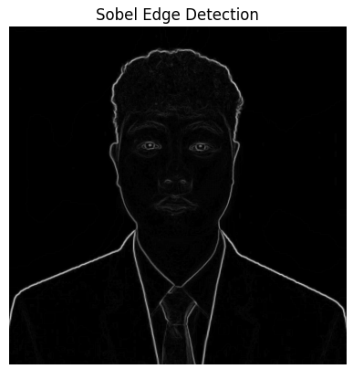

# 📘 CSST106-4A: Machine Problem No. 1
## Exploring the Role of Computer Vision and Image Processing in AI

---

https://github.com/user-attachments/assets/dfcbbd0e-0816-4ec4-a88c-36e6f57ddcf4

## 🎥 Introduction to Computer Vision and Image Processing

**Overview:**

Computer Vision is a branch of Artificial Intelligence (AI) that enables machines to interpret and understand visual information from the world. The primary goal is to replicate human visual capabilities, allowing machines to recognize objects, understand their environment, and make informed decisions based on visual inputs.

**Key Points:**

- **Role of Image Processing in AI:** Image processing is crucial for enhancing and analyzing images. It involves several stages:
  - **Preprocessing:** Improving image quality before analysis.
  - **Feature Extraction:** Identifying and extracting meaningful features from images.
  - **Decision-Making:** Utilizing deep learning to derive insights and make decisions.

---

## 🧩 Types of Image Processing Techniques

**1. Filtering:**

Filtering involves modifying an image to enhance or suppress certain features.

- **Examples:**
  - **Gaussian Blur:** Reduces noise and detail.
  - **Median Filter:** Removes noise by replacing pixel values with median values.
  - **Sharpening Filter:** Enhances image edges and details.

- **Applications in AI:**
  - **Noise Reduction:** Improves detection accuracy.
  - **Detail Enhancement:** Aids in object recognition and classification.

**2. Edge Detection:**

Edge detection identifies boundaries in images where intensity changes significantly.

- **Examples:**
  - **Canny Edge Detection:** Finds edges by detecting rapid intensity changes.
  - **Sobel Operator:** Computes image gradients to detect edges.
  - **Prewitt Operator:** Detects edges using gradient calculations.

- **Applications in AI:**
  - **Object Recognition:** Helps in outlining objects for easier classification.
  - **Feature Extraction:** Highlights important features for further analysis.

**3. Segmentation:**

Segmentation divides an image into distinct regions or objects for easier analysis.

- **Examples:**
  - **Thresholding:** Segments based on pixel intensity.
  - **Region Growing:** Expands regions based on pixel similarity.
  - **Watershed Algorithm:** Segments by identifying distinct regions using topological concepts.

- **Applications in AI:**
  - **Object Detection:** Isolates objects for detailed analysis.
  - **Medical Imaging:** Segments anatomical structures for diagnosis.

---

## 📊 Case Study Overview

**Selected AI Application:**

**Retail Inventory Management**

**How Image Processing is Used:**

- **Image Acquisition:** Captures images of store shelves using cameras.
- **Preprocessing:** Enhances image quality to ensure clear visibility of products.
- **Feature Extraction:** Identifies product types and quantities.
- **Segmentation:** Separates individual products from the background.

**Challenges Addressed:**

- **Accurate Inventory Tracking:** Ensures accurate counts and reduces manual errors.
- **Automated Restocking:** Helps in predicting inventory needs based on real-time analysis.

---

## 🔍 Your Image Processing Implementation

**Model:**

**Sobel Edge Detection**  

**How It Works:**  

- **Input:** Grayscale images of various subjects.  
- **Processing:** Applies the Sobel operator to compute gradients in the x and y directions, combining them to highlight edges.  
- **Output:** An image emphasizing the edges of objects within the original image.  

**How It Helps:**  

- **Enhances Feature Recognition:** Allows for better identification of object boundaries.  
- **Facilitates Image Analysis:** Useful in applications like object detection and segmentation in computer vision.  


**Example Code Snippet:**

```python
# Sobel Edge Detection
def sobel_edge_detection(img):
    # Convert to grayscale
    gray = cv2.cvtColor(img, cv2.COLOR_BGR2GRAY)

    # Sobel edge detection in the x direction
    sobelx = cv2.Sobel(gray, cv2.CV_64F, 1, 0, ksize=5)

    # Sobel edge detection in the y direction
    sobely = cv2.Sobel(gray, cv2.CV_64F, 0, 1, ksize=5)

    # Combine the two gradients
    sobel_combined = cv2.magnitude(sobelx, sobely)

    return sobel_combined

# Apply Sobel edge detection to the uploaded image
sobel_edges = sobel_edge_detection(image)
plt.imshow(sobel_edges, cmap='gray')
plt.title("Sobel Edge Detection")
plt.axis('off')
plt.show()

```



## 🏁 Conclusion
**Summary:**

Effective image processing plays a pivotal role in the realm of artificial intelligence, serving as the foundation upon which many AI systems build their capabilities to interpret and analyze visual data. The application of image processing techniques such as filtering, edge detection, and segmentation significantly enhances the ability of AI systems to process visual information with greater accuracy and efficiency.

Filtering: This technique improves image quality by removing noise and enhancing important features. By smoothing out unwanted variations and emphasizing key details, filtering allows AI systems to work with cleaner and more reliable data, which is essential for accurate analysis and decision-making.

Edge Detection: Identifying boundaries within an image where there is a significant change in intensity or color is crucial for understanding the structure of visual elements. Edge detection helps in outlining objects and features within an image, making it easier for AI systems to recognize and classify them. This is particularly useful in applications such as object detection and facial recognition.

Segmentation: Segmenting an image into distinct regions or objects simplifies the analysis process. By isolating different parts of an image, segmentation enables AI systems to focus on specific areas of interest. This technique is vital for tasks like object detection, where precise identification and localization of items are required. It also plays a crucial role in medical imaging, where accurate segmentation of anatomical structures aids in diagnosis and treatment planning.

Together, these image processing techniques empower AI systems to achieve more precise object recognition, feature extraction, and overall decision-making. They enable machines to understand and interpret visual data in a way that closely mimics human visual perception, leading to more effective and intelligent applications across various domains.

In conclusion, the integration of robust image processing techniques into AI systems not only enhances their ability to handle complex visual data but also drives advancements in fields ranging from autonomous vehicles to medical diagnostics. The continual development and refinement of these techniques will play a critical role in the future evolution of AI and its applications.

# Image Processing Report

## Overview

This report outlines the steps taken to process an image using various techniques in OpenCV. The goal was to demonstrate image manipulation methods including scaling, rotation, blurring, and edge detection.

## Steps Taken

### Step 1: Install OpenCV
* Installed the `opencv-python-headless` package for image processing capabilities.

### Step 2: Import Necessary Libraries
* Imported libraries:
  * `cv2` for image processing.
  * `numpy` for handling arrays and matrices.
  * `matplotlib.pyplot` for displaying images.

### Step 3: Load an Image
* Used Google Colab's file upload feature to load an image.
* Converted the uploaded image to OpenCV format (BGR).

### Step 4: Scaling and Rotation
* **Scaling**: Implemented a function to resize the image using a scale factor of 0.1.
  * **Output**: A scaled-down version of the original image.
* **Rotation**: Implemented a function to rotate the image by 45 degrees.
  * **Output**: The image displayed at a 45-degree angle.

### Step 5: Blurring Techniques
* **Gaussian Blur**: Applied a Gaussian blur with a 5x5 kernel.
  * **Output**: A smoother version of the original image.
* **Median Blur**: Applied a median blur with a 5x5 kernel.
  * **Output**: An image with reduced salt-and-pepper noise.
* **Motion Blur**: Implemented a custom function for motion blur using a kernel size of 15.
  * **Output**: An image with a streak effect simulating motion.
* **Bilateral Filter**: Applied to maintain edges while reducing noise.
  * **Output**: A detailed image with less noise.

### Step 6: Edge Detection Techniques
* **Canny Edge Detection**: Used Canny method with thresholds of 100 and 200.
  * **Output**: Edge-detected version of the original image.
* **Laplacian Edge Detection**: Implemented to highlight edges.
  * **Output**: A grayscale image showing edges.
* **Sobel Edge Detection**: Applied in both x and y directions and combined.
  * **Output**: A combined gradient image emphasizing edges.
* **Prewitt Edge Detection**: Utilized Prewitt operator kernels for edge detection.
  * **Output**: An image showing edges detected by the Prewitt method.

## Summary

In this assignment, various image processing techniques were applied to manipulate and analyze an image. The processes included scaling, rotating, applying different types of blurring, and detecting edges using various methods. Each step produced visually distinct outputs, showcasing the capabilities of OpenCV for image manipulation.

